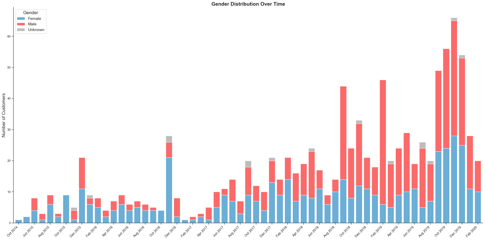

# Overview
Welcome to my analysis of the performance of a fintech company in the Czech Republic. This project focuses on [Twisto.cz](https://www.twisto.cz) and was created as part of a case study during an interview process.  

The dataset provided by the company includes information about new client registrations, customer demographics such as age, gender, and education, as well as details of transactions and the use of payment extensions. 

Using Python, I explored the data to better understand who Twisto’s customers are, how they behave when making purchases, and how often payments are deferred. The goal of this project is to present an accessible, data-driven overview of customer behavior and highlight insights that could support business and product decisions.

# The Questions
In this project, I aim to explore three main areas:

1. What is the socio-demographic profile of Twisto’s customers, and how does it change over time or by channel?
2. Do Apple and Android users differ in their purchasing behavior?
3. How do deferral rates develop over time, and do they vary across channels?


# Tools I Used
For this project, I worked with several tools that supported both analysis and presentation:

- **Python** – the main language for exploring the data  
  - **Pandas** for data analysis  
  - **NumPy** for numerical operations  
  - **Matplotlib** and **Seaborn** for visualizations  
  - **Streamlit** for creating simple interactive views  

- **Jupyter Notebooks** – to run code and document the analysis step by step  

- **Visual Studio Code** – for writing and testing Python scripts  

- **Git & GitHub** – for version control and sharing the project

# Data Preparation and Cleanup

In this section, I describe the steps taken to prepare the dataset for analysis, ensuring that it is accurate, clean, and ready for exploration.

## Import & Clean Up Data

First, I imported the necessary libraries and loaded the dataset, then extracted individual data frames for different aspects of the data.

```python
import pandas as pd
import streamlit as st

# Loading of Excel file
excel_file = pd.read_excel('data_source/Twisto_data.xlsx', sheet_name=None)

# Extracting of individual DataFrames
df_base = excel_file['profile_base']
df_customer = excel_file['profile_customer']
df_extension = excel_file['profile_extension']
df_apps = excel_file['profile_apps']
df_transactions = excel_file['profile_transactions']

```
Next, I performed data cleaning tasks to ensure quality and consistency.

```python
# Correct specific incorrect dates
df_base['date_upgraded'] = df_base['date_upgraded'].replace({
    '2090-10-12 09:55:36.000': '2014-10-12 09:55:36.000',
    '2080-12-23 22:50:47.000': '2015-12-23 22:50:47.000'
})

# Convert to datetime
df_base['date_upgraded'] = pd.to_datetime(df_base['date_upgraded'], errors='coerce')

# Fill in all empty values in df_transaction (column: category)
df_transactions['category'] = df_transactions['category'].fillna('Unknown')

```
View my notebook with detailed steps here: [Data_cleaning_steps.ipynb](twisto_project/1_Data_cleaning_steps.ipynb).

# The Analysis

Each Jupyter Notebook in this project focuses on a specific aspect of the company's performance. Below is an overview of how I approached each question:

## 1. What is the socio-demographic profile of Twisto’s customers, and how does it change over time or by channel??


View my notebook with detailed steps here: [Demographic_analysis.ipynb](twisto_project/2_Demographic_analysis.ipynb).

### Visualize Data

```python

```

### Results



*Stacked bar chart showing how the composition of acquired users changed over time (October 2014 to January 2020).*

### Insights:


## 2. Do Apple and Android users differ in their purchasing behavior?


View my notebook with detailed steps here: [OS_users_analysis.ipynb](twisto_project/3_OS_users_analysis.ipynb).

### Visualize Data

```python


```

### Results

  
* *

### Insights:


## 3. How do deferral rates develop over time, and do they vary across channels??


View my notebook with detailed steps here: []().

#### Visualize Data 

```python


```

#### Results

  
* *

#### Insights


# What I Learned


# Insights


# Challenges I Faced


# Conclusion


